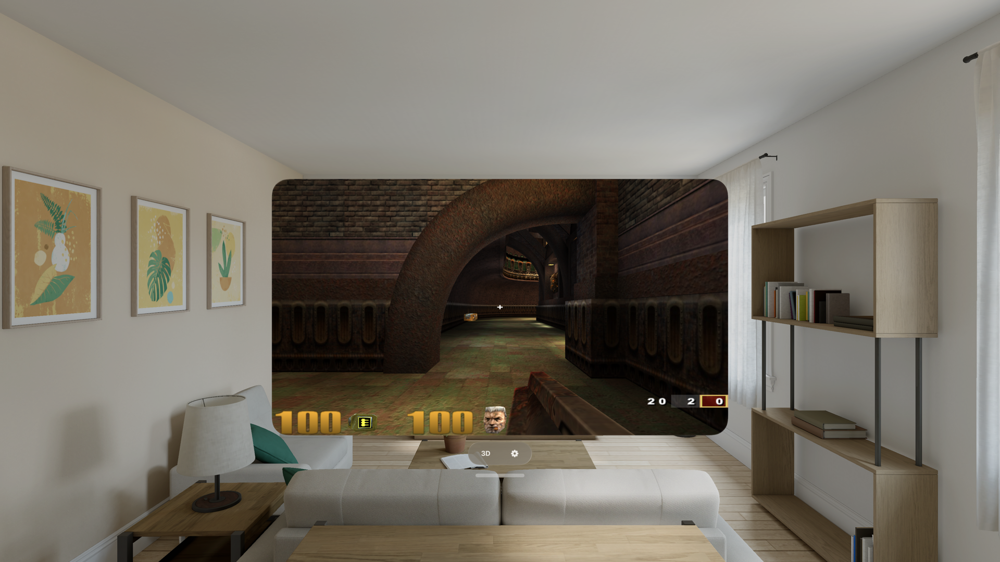

# Quake3e for iPhone & Apple Vision Pro

Play **Quake III Arena** on your iPhone and Apple Vision Pro — full single-player
bot ladder, real internet multiplayer, mods, and on Vision Pro both a
stereoscopic **3D mode** (the game on a floating screen with real depth) and a
full **immersive VR mode**: you stand inside the arena, world-locked and
head-tracked, aiming with your gaze, a gamepad, or PlayStation VR2 Sense
controllers. 100% vibe coded with lots of passion and attention to detail.

Built on [Quake3e](https://github.com/ec-/Quake3e), the maintained,
performance-focused ioquake3 engine, running its native Vulkan renderer on Metal.
Locked 120 fps on ProMotion at native resolution.



---

## Install

**The easy way — the auto-updating source (SideStore / AltStore).** Add the shared
Quake-ports source, then install Quake III from it; future updates appear
automatically:

- iPhone / iPad: `https://raw.githubusercontent.com/rebelancap/quake-ports/main/apps-ios.json`
- Apple Vision Pro: `https://raw.githubusercontent.com/rebelancap/quake-ports/main/apps-visionos.json`

On Apple Vision Pro, first install SideStore onto the headset with
[iloader](https://github.com/rebelancap/iloader/releases#release-visionos), then add
the source in SideStore. (iloader installs SideStore itself — apps are then
installed and kept refreshed by SideStore.)

**Or manually:** download the IPA for your device from the
[latest release](../../releases/latest) — `Quake3-*-iOS.ipa` for iPhone / iPad,
`Quake3-*-visionOS.ipa` for Apple Vision Pro — and sideload it with
[SideStore](https://sidestore.io), [AltStore](https://altstore.io), or
[Sideloadly](https://sideloadly.io). Xcode or Dev Strap not required.

**Then add your Quake III files** (see below) at first launch via the built-in picker
(works with iCloud/OneDrive folders), or later via **Files** app →
*On My iPhone / Vision Pro → Quake3e* → drop in your `baseq3` folder.

## You bring the game

Quake3e ships with **no game content** — you must own Quake III Arena and provide
your own files. Copy your `baseq3` folder (the important file is `pak0.pk3`) into
the app:

- **Quake III Arena** — Steam, GOG, or the original CD all work. The app detects
  retail vs demo data and includes the free 1.32 point-release paks.
- **Quake III: Team Arena** — optional; drop your `missionpack` folder in the same
  way and launch it from the mods menu.

Mods are pure data in Quake III — no code signing, no jailbreak. Put each mod in
its own folder next to `baseq3` (e.g. `cpma`, `osp`, `defrag`, `q3ut4` for Urban
Terror) and it appears in the in-game MODS menu. Missing maps download
automatically from servers that offer them.

## Features

- Full single-player skirmish + bot ladder with progress saves, cinematics, music
- **Internet & LAN multiplayer** — live server browser, joining, and automatic
  map/pk3 downloads all work end to end
- **Mods as drop-in data** — CPMA, OSP, defrag, Urban Terror, Team Arena
- Demos record and play back; full console (3-finger tap for keyboard)
- **Game controllers** (MFi / DualSense / Xbox) with a sane default layout, every
  button rebindable; on-screen touch sticks + **gyro aim**
- 60 / 120 Hz (ProMotion), in-app settings that persist
- **Apple Vision Pro:** free-resizing 2D window, plus a **3D mode** — the game on a
  world-locked stereoscopic panel with real depth, controller-aimed, with
  live-tunable screen size, distance, height, stereo depth, crosshair distance,
  and room dimming; sound follows the screen
- **Apple Vision Pro VR mode** — full immersion: stand inside the arena at real
  scale, world-locked and head-tracked at native refresh.
  - **Three ways to aim**: your gaze (crosshair follows where you look),
    **PlayStation VR2 Sense controllers** (true hand aim with haptics — the gun
    is in your hand), or classic **gamepad aiming** (stick turns the view,
    crosshair dead center, just like flat Quake)
  - World-space crosshair at real depth along your aim, never swallowed by
    geometry; the weapon model rides your hand with per-weapon anchoring
  - HUD and menus on an in-world panel — size, height, and on/off all tunable;
    scoreboard scales to fit full servers
  - Comfort & tuning: snap or smooth turn, movement direction (head / aim),
    height calibration with trim, render quality up to 2×, CAS sharpening,
    Show Hands, damage-flash toggle, one-tap recenter
  - Multiplayer, mods (CPMA, OSP, Urban Terror…), and the whole single-player
    ladder all work in VR; hardware keyboards type into the game, and the
    visionOS keyboard pops up on text fields automatically

## Requirements

- iPhone/iPad on **iOS 16+**, or **Apple Vision Pro** (visionOS 2+)
- A sideloading tool — SideStore / AltStore (on Vision Pro,
  [iloader](https://github.com/rebelancap/iloader/releases#release-visionos) installs
  SideStore for you)
- Your own Quake III Arena game files

## Controls

**Touch:** left ~40% of screen is a floating move stick; drag anywhere else to
look. FIRE / JUMP / DUCK / weapon-switch buttons bottom-right. Gear button
(top-left, in menus) opens the app settings — sensitivity, gyro aim, touch size
and opacity, refresh rate, FPS counter, and the Vision Pro 3D screen options.
≡ button (top-right) is ESC/menu. 3-finger tap: on-screen keyboard. Menus: just
tap.

**Controller:** left stick moves, right stick looks, and every button presses an
ordinary Quake III key — see **Gamepad bindings** below.

## Gamepad bindings

Every pad button simply presses a key; what that key *does* is a normal Quake III
bind, so you can lay the pad out however you like from the console or from your
own `autoexec.cfg` — in vanilla or in any mod (`q3ut4`, `cpma`, ...):

    bind AUX1 "+zoom"
    bind AUX2 "weapon 7"

| Gamepad button    | Key pressed |
|-------------------|-------------|
| RT                | MOUSE1      |
| LT                | MOUSE2      |
| A                 | SPACE       |
| B                 | AUX6        |
| X                 | ENTER       |
| Y                 | AUX1        |
| LB                | [           |
| RB                | ]           |
| L3                | c           |
| R3                | AUX7        |
| D-pad up          | AUX2        |
| D-pad down        | AUX3        |
| D-pad left        | AUX4        |
| D-pad right       | AUX5        |
| Options (VIEW)    | TAB         |
| Menu (START)      | ESCAPE      |

Two of these arrive pre-bound so the pad works out of the box: `AUX6` to
`+movedown` (B crouches) and `AUX7` to `centerview` (R3 recentres the view).
They are ordinary binds — your own bind for either one simply replaces it.

One catch: the in-game *Controls* menu cannot capture a pad press, because in
menus the pad becomes the navigation controller (d-pad and left stick move
between items, A confirms, B goes back, RT clicks). Bind pad keys by name from
the console or an `autoexec.cfg` instead.

## Shortcuts (one-tap mod launchers)

In the Shortcuts app, add the **"Launch Quake III Mod"** action (search
"Quake3e"), set the mod folder — `q3ut4` (Urban Terror), `cpma`, `missionpack`
(Team Arena), `baseq3` — and Add to Home Screen. Equivalent URL for "Open URL"
shortcuts and links: `quake3e://play?game=q3ut4`. Cold-launches straight into
the mod, or hot-switches if the app is already running.

## FAQ

**Which Quake III data should I use?** Any retail `baseq3/pak0.pk3` — Steam, GOG,
or CD. The demo's pak0 is detected but the demo license doesn't permit it here;
buy the game (it's frequently a few dollars on sale).

**Is any game content included?** No. You supply your own files; nothing
copyrighted ships with the app.

**Multiplayer?** Yes — the in-game server browser lists live internet servers,
and direct connect (`\connect address`) works. Servers running mods you don't
have will auto-download the needed pk3s when they allow it.

**The app stopped launching after about a week?** Apps sideloaded with a free
Apple account expire after 7 days (paid developer accounts last a year).
SideStore refreshes them automatically in the background — open SideStore and
let it re-sign.

---

## Building from source

Requires macOS with Xcode, plus `xcodegen` (`brew install xcodegen`; the macOS
parity build also wants `brew install molten-vk vulkan-loader`). Set your team /
device UDID in `ios/project.yml` and `scripts/deploy.sh`, then:

```sh
./scripts/bootstrap.sh           # one command: clone pinned upstream, build deps,
                                 # build + sign + install, verify on-device
```

Or piecewise: `scripts/build-ios-deps.sh` / `scripts/build-ios.sh` (iPhone),
`scripts/build-visionos-deps.sh` / `scripts/build-visionos.sh` (Vision Pro).

Upstream Quake3e is vendored unmodified and pinned by commit; every local change
is a reviewable patch in `patches/`, applied by `scripts/sync-overlay.sh` with
`--fuzz=0` (failure is loud).

## Credits & license

- [Quake3e](https://github.com/ec-/Quake3e) by Eugene C. and contributors, built
  on [ioquake3](https://ioquake3.org) and id Software's Quake III Arena source
- QUAKE III ARENA © id Software
- Licensed under the **GNU GPL v2** (see `COPYING`), matching upstream Quake3e.
